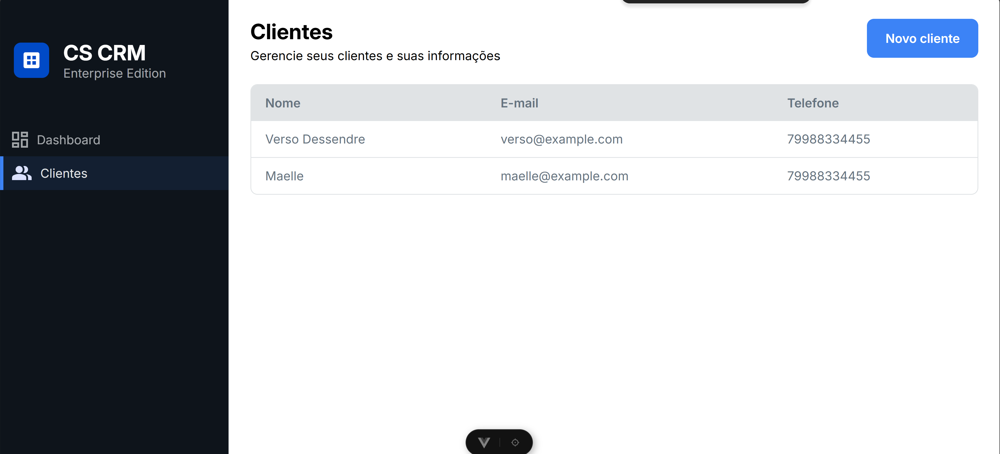

# Estudo de caso — CRM

Aplicação full-stack de CRM focada em cadastro e listagem de clientes, usando **Java/Spring Boot** no backend e **Vue 3/Vite** no frontend.

Ambos os lados seguem uma organização em camadas (domínio, aplicação e infraestrutura), com casos de uso explícitos e gateways/repositórios desacoplados da UI e do framework.



## Stack

| Camada   | Tecnologias                                      |
| -------- | ------------------------------------------------ |
| Backend  | Java 17, Spring Boot, Spring Data JPA, PostgreSQL |
| Frontend | Vue 3, TypeScript, Vite, Pinia, Vue Router       |
| Infra    | Docker Compose                                   |

## Funcionalidades

- Listagem de clientes
- Cadastro de novo cliente
- API REST em `/api/clients`
- Persistência em PostgreSQL

## Como executar

### Pré-requisitos

- [Docker](https://docs.docker.com/get-docker/) e Docker Compose

### Subir o ambiente

Na raiz do projeto:

```sh
docker compose up
```

Isso sobe três serviços:

| Serviço  | URL / porta              |
| -------- | ------------------------ |
| Frontend | http://localhost:5173    |
| Backend  | http://localhost:8080    |
| Postgres | `localhost:5432`         |

Credenciais do banco (padrão do `docker-compose.yml`):

- **Usuário:** `postgres`
- **Senha:** `secret`
- **Database:** `postgres`

### Parar

```sh
docker compose down
```

## Estrutura do repositório

```text
cs-crm/
├── backend/          # API Spring Boot
├── frontend/         # SPA Vue 3
├── docker-compose.yml
└── .github/images/   # Screenshots e assets do README
```

### Backend (`backend/`)

```text
dev.crm/
├── domain/         # Entidades e erros de domínio
├── application/    # Casos de uso e portas (repositórios)
├── infra/          # Controllers, JPA e adapters
├── di/             # Wiring de dependências
└── configuration/  # Configuração global
```

### Frontend (`frontend/`)

```text
src/
├── domain/         # DTOs
├── application/    # Contratos de gateway
├── infra/          # Implementações (HTTP)
├── http/           # Cliente HTTP
├── ui/             # Páginas e componentes
└── router.ts
```

## API

| Método | Endpoint         | Descrição        |
| ------ | ---------------- | ---------------- |
| `GET`  | `/api/clients`   | Lista clientes   |
| `POST` | `/api/clients`   | Cria um cliente  |

## Desenvolvimento local (sem Docker)

### Backend

```sh
cd backend
./mvnw spring-boot:run
```

Requer PostgreSQL acessível (por exemplo, só o serviço `database` do Compose).

### Frontend

```sh
cd frontend
npm install
npm run dev
```
